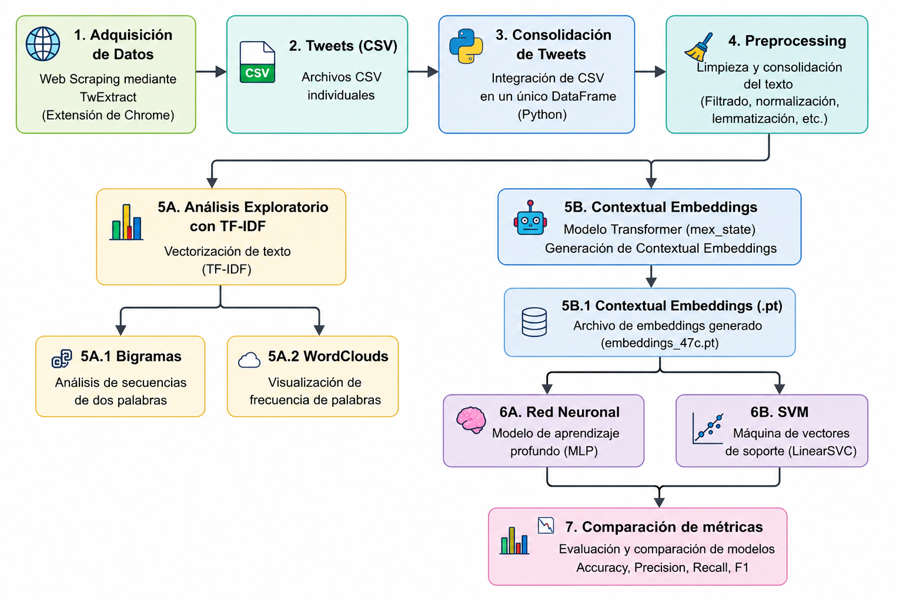

# Uso de un modelo de lenguaje para Predicción de autoría en tweets de opinólogos y políticos en español

Este repositorio contiene la implementación de un pipeline de **Procesamiento de Lenguaje Natural (PLN)** para la **clasificación de autoría de tweets**, desarrollado como parte de una tesis de maestría. El proyecto compara dos enfoques de aprendizaje automático utilizando *Contextual Word Embeddings* generados por un modelo Transformer para identificar el autor de un tweet.

---

## Descripción General del Proyecto

El pipeline sigue un flujo de trabajo modular que abarca todo el ciclo de vida del proceso de clasificación:

1. Adquisición de datos mediante *Web Scraping*.
2. Consolidación y preprocesamiento del conjunto de datos.
3. Análisis exploratorio del corpus mediante TF-IDF.
4. Generación de *Contextual Word Embeddings* utilizando un modelo Transformer.
5. Entrenamiento de modelos de clasificación:
   - Red Neuronal Multicapa (MLP)
   - Máquina de Soporte Vectorial (SVM)
6. Evaluación y comparación del desempeño de los modelos.

---

## Estructura del Repositorio

```text
.
├── notebooks/
│   ├── 01_Preprocessing.ipynb
│   ├── 02_Embeddings.ipynb
│   ├── 03_NN_Approach.ipynb
│   ├── 04_SVM_Approach.ipynb
│   └── 05_Comparisons.ipynb
│
├── data/
│   ├── raw/
│   ├── processed/
│   └── embeddings/
│
├── results/
│   ├── figures/
│   ├── metrics/
│   └── umap/
│
└── README.md
```

---

## Pipeline

```text
Web Scraping (TwExtract)
        │
        ▼
Tweets (CSV)
        │
        ▼
Consolidación de Datos
(DataFrame en Python)
        │
        ▼
Preprocesamiento
        │
   ┌────┴─────┐
   ▼          ▼
TF-IDF   Transformer
   │      (mex_state)
   │          │
Bigramas      ▼
WordClouds Contextual Embeddings
               │
         ┌─────┴─────┐
         ▼           ▼
        MLP         SVM
         │           │
         └─────┬─────┘
               ▼
 Comparación de Métricas
```

<p align="center">
  
</p>


---

## Descripción de los Notebooks

| Notebook | Descripción | Salida principal |
|-----------|-------------|------------------|
| **01_Preprocessing.ipynb** | Consolidación del conjunto de datos, preprocesamiento, análisis TF-IDF, generación de bigramas y nubes de palabras. | Conjuntos de datos preprocesados para TF-IDF y Transformers. |
| **02_Embeddings.ipynb** | Generación de *Contextual Word Embeddings* mediante un modelo Transformer. | Objeto PyTorch con los embeddings (.pt). |
| **03_NN_Approach.ipynb** | Implementación y evaluación de una Red Neuronal Multicapa (MLP). | Métricas de desempeño y visualización mediante UMAP. |
| **04_SVM_Approach.ipynb** | Implementación y evaluación de una Máquina de Soporte Vectorial (SVM). | Métricas de desempeño y visualización mediante UMAP. |
| **05_Comparisons.ipynb** | Consolidación y comparación de los resultados obtenidos por ambos modelos. | Gráficas comparativas y métricas de evaluación. |

---

## Modelos Implementados

- Transformer para la generación de *Contextual Word Embeddings*.
- Red Neuronal Multicapa (MLP).
- Máquina de Soporte Vectorial Lineal (Linear SVM).

---

## Análisis Exploratorio

Como parte del preprocesamiento se realizó un análisis exploratorio del corpus utilizando TF-IDF para identificar términos representativos de cada autor mediante:

- Análisis de frecuencia de bigramas.
- Visualización mediante nubes de palabras (*WordClouds*).

---

## Visualización de Embeddings

Los *Contextual Word Embeddings* generados por el modelo Transformer fueron proyectados a un espacio de menor dimensionalidad utilizando **UMAP**, con el objetivo de visualizar la distribución de los autores y analizar la separabilidad de las clases antes y después del entrenamiento de los modelos de clasificación.

---

## Métricas de Evaluación

El desempeño de los modelos se evaluó mediante las siguientes métricas:

- Accuracy
- Precision
- Recall
- F1-score

Las métricas fueron analizadas tanto de forma global como por clase para comparar objetivamente el desempeño de cada modelo.

---

## Tecnologías Utilizadas

- Python
- Jupyter Notebook
- Pandas
- NumPy
- Scikit-learn
- PyTorch
- Hugging Face Transformers
- UMAP
- Matplotlib
- WordCloud

---

## Contexto de Investigación

Este repositorio contiene la implementación experimental desarrollada para una tesis de maestría enfocada en la **clasificación de autoría de tweets** mediante representaciones contextuales del lenguaje y técnicas de aprendizaje automático.

El objetivo principal es comparar un modelo basado en una Red Neuronal Multicapa y una Máquina de Soporte Vectorial utilizando la misma representación contextual del texto para determinar cuál ofrece un mejor desempeño en la tarea de clasificación de autoría.

---

## Licencia

Este repositorio se distribuye con fines exclusivamente académicos y de investigación.
